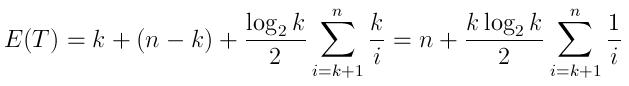

You can keep a priority queue of the 100 biggest numbers, iterate through the billion numbers, whenever you encounter a number greater than the smallest number in the queue (the head of the queue), remove the head of the queue and add the new number to the queue.

EDIT: As Dev noted, with a priority queue implemented with a heap, the complexity of insertion to queue is O(log N)

In the worst case you get billion*log2(100) which is better than billion*log2(billion)

In general, if you need the largest K numbers from a set of N numbers, the complexity is O(N log K) rather than O(N log N), this can be very significant when K is very small comparing to N.

EDIT2:

The expected time of this algorithm is pretty interesting, since in each iteration an insertion may or may not occur. The probability of the i'th number to be inserted to the queue is the probability of a random variable being larger than at least i-K random variables from the same distribution (the first k numbers are automatically added to the queue). We can use order statistics (see link) to calculate this probability. For example, lets assume the numbers were randomly selected uniformly from {0, 1}, the expected value of (i-K)th number (out of i numbers) is (i-k)/i, and chance of a random variable being larger than this value is 1-[(i-k)/i] = k/i.

Thus, the expected number of insertions is:

And the expected running time can be expressed as:

(k time to generate the queue with the first k elements, then n-k comparisons, and the expected number of insertions as described above, each takes an average log(k)/2 time)

Note that when N is very large comparing to K, this expression is a lot closer to n rather than N log K. This is somewhat intuitive, as in the case of the question, even after 10,000 iterations (which is very small comparing to a billion), the chance of a number to be inserted to the queue is very small.
